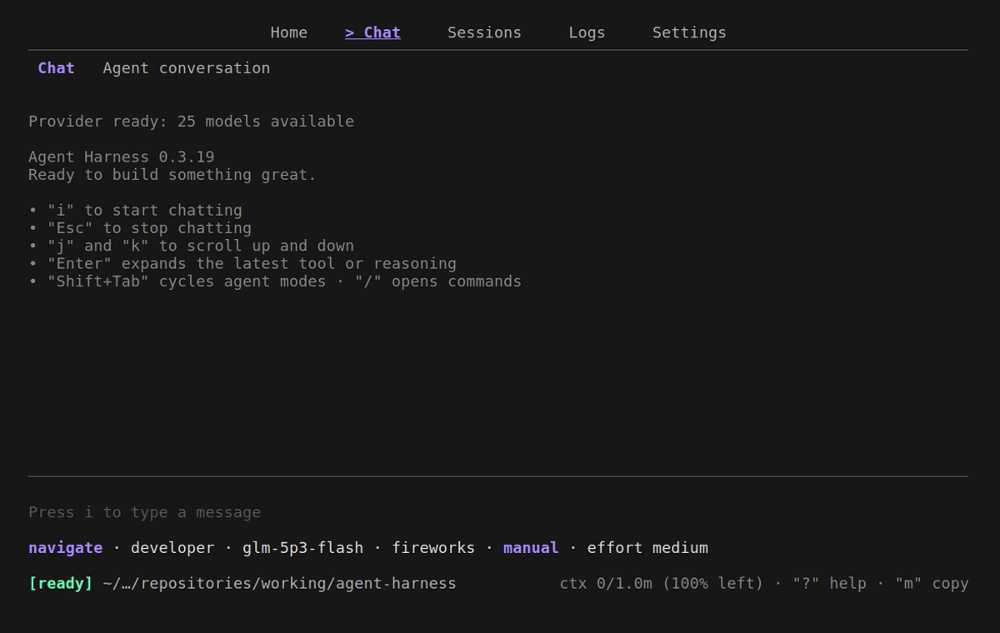

<div align="center">

# Agent Harness

**A clean-room, pattern-derived agent harness for building coding agents**

> **Safe Testing Recommended**: Agent Harness is a harness for AI coding tools
> that can modify files and execute commands. For the safest experience, test in
> a remote development environment such as
> [GitHub Codespaces](https://github.com/codespaces), [Coder](https://coder.com/),
> or [DevPod](https://devpod.sh/).

[](https://go.dev/)
[](https://opensource.org/licenses/MIT)
[](https://github.com/BA-CalderonMorales/agent-harness/blob/main/docs/index.md)
[](https://github.com/BA-CalderonMorales/agent-harness/actions/workflows/ci.yml)



</div>

## Install

The one-liner installs the binary and the runtime convenience scripts into
`~/.local/bin`. Platforms, prerequisites, and manual paths:
[Installation](docs/install.md).

```bash
# Any Linux or macOS shell
curl -fsSL https://raw.githubusercontent.com/BA-CalderonMorales/agent-harness/main/scripts/install.sh | bash

# Termux (Android)
curl -fsSL https://raw.githubusercontent.com/BA-CalderonMorales/agent-harness/main/scripts/install-termux.sh | bash

# Or build from source (this repository)
go build -o build/agent-harness ./cmd/agent-harness
```

## Quick Start

Boot the terminal UI, walk the tabs, and talk to a model. The startup wizard
handles credentials once; the modes, settings, and the full command surface:
[Usage](docs/usage.md).

```bash
# From this repository
make build
./build/agent-harness

# local-first: the repository defaults to a llama.cpp server and a local GGUF:
#   ./scripts/ah-local.sh            # local server + TUI
#   ./build/agent-harness --diagnose # resolve config, check the endpoint
```

Remote providers work the same way — switch provider and model in the Settings
tab or with env vars, then `/login` when a key is needed:

```bash
AH_PROVIDER=openrouter \
AH_MODEL=nvidia/nemotron-3-super-120b-a12b:free \
./build/agent-harness
```

## Commands

Everything happens inside the TUI: four tabs (`Home`, `Chat`, `Sessions`,
`Settings`) with vim-style navigation and a slash-command system for
operations. `/help` lists every command in place; `Ctrl+P` opens the command
palette.

**Key controls**

| Key | Purpose |
|---|---|
| `1` - `4` / `Tab` | Jump to a tab / cycle tabs |
| `j` `k` `g` `G` | Scroll the active pane |
| `i` / `Esc` | Enter / leave compose mode |
| `h` `c` | Jump to Home / Chat |
| `/` / `Ctrl+P` | Slash suggestion / command palette |
| `Ctrl+R` | Cycle reasoning effort |
| `?` | Help overlay |
| `Ctrl+C` | Clear the draft, then quit |

**Slash commands**

| Group | Commands |
|---|---|
| Core | `/help` `/clear` `/compact` `/version` `/workspace` |
| Session | `/status` `/session` `/steer` |
| Model | `/model` `/current-model` |
| Settings | `/config` `/permissions` `/login` `/logout` |
| Git | `/branch` `/pr` |
| Output | `/cost` `/export` |
| Tools | `/agents` `/skills` `/audit` `/plan` |

**Headless flags**

```bash
agent-harness --diagnose   # resolve config, check model file + endpoint
agent-harness --version
```

## Layout

The repository is a few small planes, and every Go domain is bucketed the same
way — once you can read one, you can read them all.

```text
cmd/agent-harness/           # the app: boot, command wiring, TUI delegates
internal/
├── agent/                   # the live agent loop (streaming executor)
├── core/                    # cross-cutting state
│   ├── audit/               # tool-activity ledger
│   ├── config/              # layered YAML + env + user settings
│   ├── persona/             # behavior modes
│   ├── planning/            # task planning
│   └── state/               # session model and persistence
├── interface/               # the public surfaces
│   ├── approval/            # command approval system
│   ├── commands/            # slash command registry
│   └── tui/                 # the terminal UI (Bubble Tea)
├── runtime/
│   ├── llm/                 # OpenAI-compatible client, SSE, probing
│   ├── permissions/         # permission stacking
│   ├── services/            # provider services
│   └── tools/               # tool registry and buckets
├── session/                 # session ledger + the modular loop buckets
└── ui/                      # line editor, stream rendering, screens
pkg/                         # shared types, messages, git, bash, sandbox
```

Each domain keeps one concept per file with a facade for its public surface,
and tests mirror the sources beside them. Files target 400 lines or fewer and
`make verify` measures that shape so it stays observable. Developers:
[Development docs](docs/index.md).

## Docs

Browse the whole folder from the [docs index](docs/index.md). What this is
for, and how the loop moves a turn: [Architecture](docs/architecture.md).

| Document | What |
|---|---|
| [Usage](docs/usage.md) | Tabs, controls, compose mode, slash commands |
| [Installation](docs/install.md) | Platforms, prerequisites, manual paths |
| [Local models](docs/local-models.md) | llama.cpp, GGUF download, overrides |
| [Environment variables](docs/environment-variables.md) | Every override, one table |
| [Conversation flow](docs/conversation_flow.md) | How a turn moves through the app |
| [Loop architecture](docs/loop-architecture.md) | The agent loop, buckets, naming |
| [Command approval](docs/command-approval.md) | How commands get approved |
| [Branch protection](docs/branch-protection.md) | Release flow and branch rules |
| [Supported models](docs/supported_models.md) | Provider/model matrix |
| [Demo](docs/demo.md) | The recording, the mock server, making new demos |

## License

MIT
